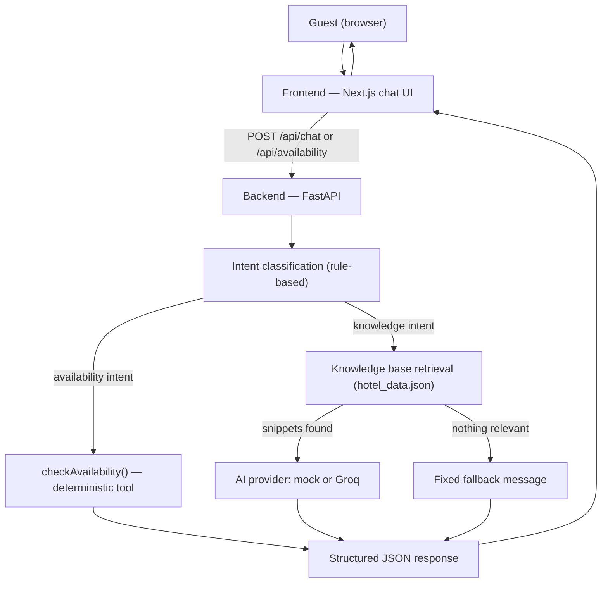

# Grand Horizon Hotel — AI Guest Assistant

A full-stack AI-powered guest assistant for a hotel website. Guests can ask
natural-language questions about the property (check-in times, amenities,
policies, room suitability) and check live room availability — all through a
single chat interface.

**Companion doc:** [`INTERVIEW_DEFENSE_GUIDE.md`](./INTERVIEW_DEFENSE_GUIDE.md)
covers how to explain every part of this project in an interview.

---

## 1. Project Overview

This is a two-part application:

- **`backend/`** — a FastAPI service that classifies guest questions, answers
  them from a grounded hotel knowledge base (with an LLM or a deterministic
  mock generator), and looks up room availability through a separate,
  non-AI business-logic function.
- **`frontend/`** — a Next.js chat UI where guests type questions, click
  suggested prompts, or fill in an availability form, and see grounded
  answers and structured room results.

It was built as a hiring assignment, sized for **6–8 focused hours**, and is
intentionally simple rather than "enterprise": no database, no auth, no
microservices — a single backend service and a single frontend app.

## 2. Customer Problem

Hotel guests currently have two ways to get quick answers: call the front
desk, or dig through the hotel's website. Both are slower than they should
be for questions with a definite, known answer ("Is breakfast included?",
"Do you have a pool?"). And checking room availability usually means
navigating to a separate booking widget. A guest assistant that answers
common questions instantly, and can also surface room availability in the
same conversation, reduces friction for the guest and front-desk call volume
for the hotel.

## 3. Key Features

- Conversational chat interface with a real, working backend behind it
- Grounded answers to property, room, amenity, and policy questions
- Natural-language or form-based room availability checks
- Deterministic (non-AI) availability logic — the LLM never invents rooms,
  prices, or vacancy
- Follow-up/context handling ("Do you have a pool?" → "What are its
  timings?")
- Works fully offline from any LLM provider via a mock AI mode
  (`AI_PROVIDER=mock`), with an optional Groq-backed mode
  (`AI_PROVIDER=groq`)
- Graceful, explicit fallback messaging — the app never pretends to know
  something it doesn't
- 42 automated backend tests covering all 12 required evaluation scenarios

## 4. Architecture



The browser **never** calls an LLM directly and never sees any AI provider
key — every request goes to our own FastAPI backend first.

## 5. Tech Stack

| Layer | Choice | Why |
|---|---|---|
| Backend | Python 3.11+ / FastAPI / Pydantic v2 | Async-ready, automatic request validation, self-documenting (`/docs`), minimal boilerplate for a project this size |
| AI provider | Pluggable: mock (default) or Groq (Llama 3.1 8B) | App must run with zero API keys; Groq is fast and has a generous free tier for a demo |
| Knowledge base | Flat JSON file, in-memory | No real data-persistence need at this scale; a database would be over-engineering |
| Frontend | Next.js 14 (App Router) + TypeScript + Tailwind CSS | Modern React defaults, fast to build a polished UI, strong typing shared with backend contracts |
| Testing | pytest + FastAPI `TestClient` | Fast, no external services needed, tests both units (pure functions) and HTTP behavior |

## 6. Folder Structure

```
hotel-guest-assistant/
├── backend/
│   ├── app/
│   │   ├── main.py                 # FastAPI app, CORS, global error handlers
│   │   ├── core/                   # config, logging
│   │   ├── models/schemas.py       # Pydantic request/response models
│   │   ├── data/hotel_data.json    # Grand Horizon Hotel knowledge base
│   │   ├── tools/availability.py   # deterministic checkAvailability()
│   │   ├── services/               # retrieval, intent, AI providers, orchestration
│   │   └── api/                    # health, chat, availability routes
│   ├── tests/                      # 38 pytest tests
│   ├── requirements.txt
│   └── .env.example
├── frontend/
│   ├── app/                        # layout, page, global styles
│   ├── components/                 # ChatWindow, MessageBubble, AvailabilityForm/Card, SuggestedQuestions
│   ├── lib/api.ts                  # the only place that calls the backend
│   ├── types/index.ts              # shared TS types mirroring backend schemas
│   └── .env.local.example
├── README.md
├── INTERVIEW_DEFENSE_GUIDE.md
└── .gitignore
```

## 7. Setup Instructions

Prerequisites: Python 3.11+, Node.js 18+, npm.

```bash
git clone <this-repo-url>
cd hotel-guest-assistant
```

Then follow the backend and frontend sections below (backend first — the
frontend expects it on `http://localhost:8000`).

## 8. Environment Variables

**`backend/.env`** (copy from `backend/.env.example`):

| Variable | Default | Notes |
|---|---|---|
| `AI_PROVIDER` | `mock` | `mock` or `groq` |
| `GROQ_API_KEY` | *(empty)* | required only if `AI_PROVIDER=groq` — get one free at console.groq.com |
| `GROQ_MODEL` | `llama-3.1-8b-instant` | any Groq chat model |
| `CORS_ORIGINS` | `http://localhost:3000,http://localhost:3001` | comma-separated allowed frontend origins (3001 included since Next.js falls back to it if 3000 is taken) |
| `MAX_CONTEXT_TURNS` | `4` | conversation turns forwarded to the AI provider |
| `LOG_LEVEL` | `INFO` | |

**`frontend/.env.local`** (copy from `frontend/.env.local.example`):

| Variable | Default | Notes |
|---|---|---|
| `NEXT_PUBLIC_API_URL` | `http://localhost:8000` | backend base URL |

No secrets are hardcoded anywhere in the codebase.

## 9. How to Run the Backend

```bash
cd backend
python -m venv venv
source venv/bin/activate        # Windows: venv\Scripts\activate
pip install -r requirements.txt
cp .env.example .env
uvicorn app.main:app --reload --port 8000
```

Visit `http://localhost:8000/docs` for interactive API docs (auto-generated
by FastAPI from the Pydantic schemas).

## 10. How to Run the Frontend

```bash
cd frontend
npm install
cp .env.local.example .env.local
npm run dev
```

Visit `http://localhost:3000`. The backend must already be running.

## 11. API Endpoints

| Method | Path | Purpose |
|---|---|---|
| `GET` | `/api/health` | Service + AI-provider status |
| `POST` | `/api/chat` | Ask a question or a natural-language availability request |
| `POST` | `/api/availability` | Structured availability lookup |

## 12. Example curl Requests

```bash
# Health check
curl http://localhost:8000/api/health

# Knowledge question
curl -X POST http://localhost:8000/api/chat \
  -H "Content-Type: application/json" \
  -d '{"message": "Is breakfast included?", "conversation": []}'

# Follow-up question, with conversation context
curl -X POST http://localhost:8000/api/chat \
  -H "Content-Type: application/json" \
  -d '{
        "message": "What are its timings?",
        "conversation": [
          {"role": "user", "content": "Do you have a pool?"},
          {"role": "assistant", "content": "Yes, Grand Horizon Hotel has an outdoor swimming pool..."}
        ]
      }'
```

## 13. Example Availability Request

```bash
curl -X POST http://localhost:8000/api/availability \
  -H "Content-Type: application/json" \
  -d '{"checkIn": "2026-10-10", "checkOut": "2026-10-12", "adults": 3}'
```

```json
{
  "available": true,
  "checkIn": "2026-10-10",
  "checkOut": "2026-10-12",
  "guests": 3,
  "nights": 2,
  "rooms": [
    {
      "id": "executive-suite",
      "name": "Executive Suite",
      "bedConfig": "1 King Bed + Sofa Bed",
      "capacity": 3,
      "pricePerNight": 7200,
      "currency": "INR",
      "amenities": ["Free Wi-Fi", "Air Conditioning", "Lounge Access", "Mini Bar", "City View"]
    },
    {
      "id": "family-suite",
      "name": "Family Suite",
      "bedConfig": "1 King Bed + Sofa Bed",
      "capacity": 4,
      "pricePerNight": 8500,
      "currency": "INR",
      "amenities": ["Free Wi-Fi", "Air Conditioning", "Mini Bar", "Extra Storage", "City View"]
    }
  ],
  "message": "We found 2 room type(s) available for 3 guest(s) from 2026-10-10 to 2026-10-12."
}
```

## 14. Testing Instructions

```bash
cd backend
source venv/bin/activate
python -m pytest tests/ -v
```

**Result at time of writing: 42 passed, 0 failed.** Frontend automated tests
were intentionally skipped for this scope (see Known Limitations) in favor
of the manual QA checklist below; the full `npm run build` was verified to
compile and statically prerender cleanly.

## 15. AI Architecture

```
Guest message
  → Frontend (Next.js)
  → Backend /api/chat
  → Intent classification (regex/keyword — deterministic)
      ├─ availability intent → checkAvailability() tool (deterministic, no AI)
      └─ knowledge intent →
            → Retrieve relevant snippets from hotel_data.json (keyword overlap)
            → If nothing relevant: return fixed fallback message, skip AI entirely
            → If relevant: AI provider (mock template OR Groq LLM) generates the
              reply, constrained to ONLY the retrieved snippets
  → Structured JSON response (message, type, sources, availability)
  → Frontend renders bubble (+ availability card if present)
```

## 16. Hallucination Prevention Strategy

- **Availability is never generated by an LLM.** `app/tools/availability.py`
  is a pure Python function; the LLM is not in its call path at all.
- **Retrieval gates generation.** If keyword-overlap retrieval over
  `hotel_data.json` finds nothing relevant, the fixed fallback message is
  returned directly — the AI provider is never even called.
- **The LLM is instructed to answer only from supplied facts.** The Groq
  system prompt explicitly forbids inventing prices, policies, or
  availability, and instructs the model to say so when facts are
  insufficient.
- **The mock provider is hallucination-proof by construction** — it composes
  its answer directly from retrieved snippet text, never generating novel
  claims.
- Verified with an explicit test:
  `test_chat_hallucination_attempt_falls_back_instead_of_inventing` — asking
  about something entirely absent from the knowledge base (a helicopter
  landing pad) returns the fallback message, not an invented answer.

## 17. Error / Fallback Strategy

| Situation | Response |
|---|---|
| Unknown question (nothing relevant retrieved) | "I'm sorry, I don't have enough information in the hotel knowledge base to answer that reliably." |
| AI provider fails (timeout, no key, API error) | "I'm having trouble processing that right now. Please try again." |
| Availability lookup fails unexpectedly | "I couldn't check room availability right now. Please try again in a moment." |
| Invalid/out-of-order dates | "Please provide a valid check-in and check-out date, with check-out after check-in." |
| Malformed request body | HTTP 422 with a clear field-level message |
| Any unhandled server exception | HTTP 500 with a generic safe message — no stack trace ever reaches the client |
| Frontend can't reach the backend at all | A dedicated network-error message in the chat, input re-enabled |

## 18. Product & UX Decisions

1. **What customer problem are we solving?** Reducing the guest's time-to-answer for common questions, and making availability checks feel like part of the same conversation rather than a separate booking flow.
2. **What is the guest journey?** Land on the page → see a welcome message and suggested questions → ask freely or tap a suggestion → optionally open the availability form → get a grounded answer or structured room results → ask follow-ups.
3. **Why a chat interface?** It's the lowest-friction way to ask an open-ended question, and it naturally supports follow-ups without the guest re-stating context.
4. **How does the availability flow work?** Either natural language ("rooms for 3 guests from 2026-10-10 to 2026-10-12?") is parsed by the backend, or the guest uses the explicit form — both call the same deterministic `checkAvailability()` function, so results are always consistent.
5. **Which interactions use AI?** Only answering open-ended knowledge questions grounded in retrieved facts.
6. **Which interactions remain deterministic?** Intent classification, all availability logic, and the fallback/error paths.
7. **What could go wrong?** The AI provider could go down or return something off-topic; the knowledge base could be incomplete; a guest could ask something genuinely ambiguous.
8. **How do we prevent hallucinations?** See section 16.
9. **What happens when AI fails?** A fixed, honest error message — never a guess.
10. **How would we measure whether this feature is useful?** See proposed metrics below.
11. **What would we improve before production?** See section 22.

**Proposed metrics** (labeled as proposed — not real production data):
- Successful question resolution rate (non-fallback responses / total questions)
- Fallback rate (should trend down as the knowledge base grows)
- Availability search completion rate (searches that return ≥1 room)
- Average response time per chat turn
- Repeat-question rate (same topic asked more than once in a session — signals an unclear first answer)
- Conversation abandonment rate (session ends right after a fallback or error)
- Guest satisfaction (e.g. simple thumbs up/down per response)

## 19. Engineering Decisions

- **Stateless backend, client-held conversation history.** Avoids needing a
  session store for a single-session assignment; the frontend re-sends
  history each turn.
- **Word-overlap retrieval instead of embeddings/vector DB.** At this data
  scale (a dozen or so knowledge entries) a vector database would be pure
  over-engineering; overlap scoring is transparent and fully debuggable.
- **Rule-based intent classification instead of an LLM call.** Routing
  between "availability" and "knowledge" is a business decision that must
  be predictable and unit-testable, not something to delegate to a model.
- **Provider abstraction (`AIProvider`).** Swapping `AI_PROVIDER=mock` for
  `AI_PROVIDER=groq` requires zero changes to the chat orchestration code.

## 20. Evaluation Scenarios and Results

All 12 scenarios called out in the assignment are covered by automated
tests (42 total, all passing at time of writing):

| # | Scenario | Test(s) |
|---|---|---|
| 1 | Normal hotel question | `test_chat_answers_known_faq_question` |
| 2 | Amenity question | `test_chat_answers_known_faq_question` (pool) |
| 3 | Room suitability question | `test_chat_answers_room_suitability_question` |
| 4 | Policy question | `test_chat_answers_policy_question` |
| 5 | Missing information | `test_retrieve_returns_empty_for_irrelevant_query`, `test_chat_hallucination_attempt_falls_back_instead_of_inventing` |
| 6 | Ambiguous question | `test_chat_ambiguous_question_still_gets_a_safe_response` |
| 7 | Availability request | `test_chat_availability_via_natural_language_with_full_params`, `test_availability_endpoint_happy_path` |
| 8 | Invalid availability dates | `test_chat_availability_via_natural_language_invalid_dates`, `test_availability_endpoint_rejects_invalid_dates` |
| 9 | Unsupported assumption / hallucination attempt | `test_chat_hallucination_attempt_falls_back_instead_of_inventing` |
| 10 | Follow-up conversation | `test_chat_follow_up_question_resolves_pronoun_via_context` |
| 11 | Backend/model failure | `test_chat_provider_failure_returns_safe_fallback_message` |
| 12 | Frontend-to-backend end-to-end flow | All `TestClient`-based tests in `test_chat.py` / `test_availability.py` exercise the real HTTP contract the frontend uses |

**Manual frontend QA checklist** (run against `npm run dev` + backend on `:8000`):
- [ ] Welcome state shows title, tagline, suggested questions
- [ ] Clicking a suggested question sends it and shows a loading indicator
- [ ] Assistant response renders in a distinct bubble from the user's
- [ ] Availability form validates check-out > check-in and guest count 1–8
- [ ] Availability results render as a room list with prices
- [ ] Stopping the backend and sending a message shows a network-error bubble, input re-enabled
- [ ] Layout is usable at a mobile width (~375px) and a desktop width

## 21. AI Tools Used During Development

This project was built with **Claude** (Anthropic) as a pair-programmer:
generating the initial architecture, source files, and tests; the author is
expected to be able to explain every design decision in the codebase (see
the Interview Defense Guide).

## 22. Production Improvements

- Persist conversation history server-side (Redis or a database) instead of
  resending it from the client every turn, once multi-device continuity
  matters
- Replace keyword-overlap retrieval with embeddings if the knowledge base
  grows large enough that word overlap starts missing relevant matches
  (a real reservations system with a proper database, instead of the mock
  date-hash inventory rule
- Add authentication if guests need to see a real, personal booking
- Add response streaming for perceived latency on longer AI-generated answers
- Add structured logging/metrics export (e.g. to a hosted log/metrics service)
  instead of stdout logging
- Add frontend automated tests (component tests with React Testing Library)
- Add rate limiting on the public API endpoints

## 23. Known Limitations

- Availability inventory is a deterministic **mock** (hash-based), not a
  real reservations database — clearly documented in
  `app/tools/availability.py`
- Retrieval is keyword-overlap based; a much larger knowledge base would
  benefit from embeddings-based retrieval
- No authentication — anyone with the URL can use the assistant (acceptable
  for a public-facing hotel FAQ/availability tool, not for anything
  involving a guest's actual reservation)
- No automated frontend test suite (manual QA checklist provided instead)
- Conversation history is not persisted across page reloads
